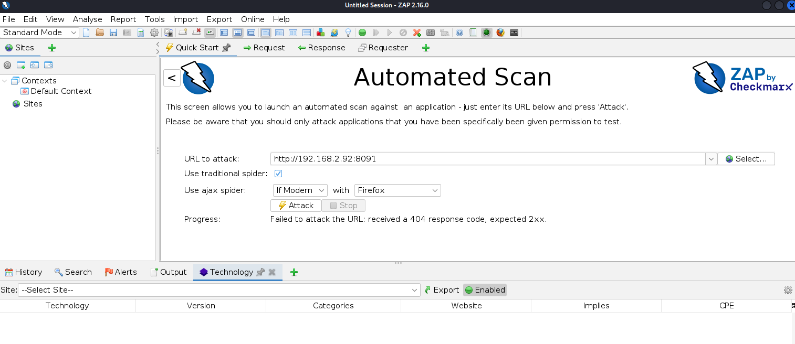
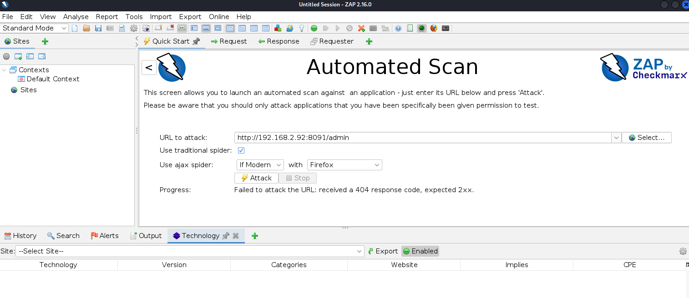
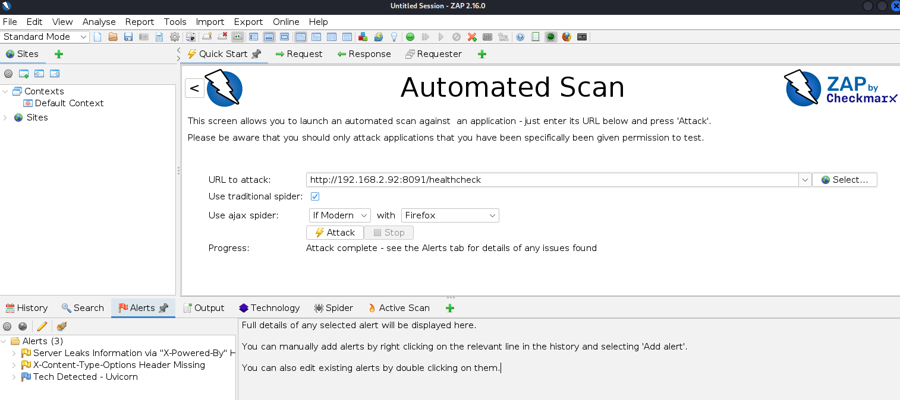
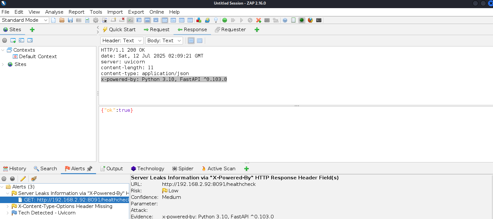
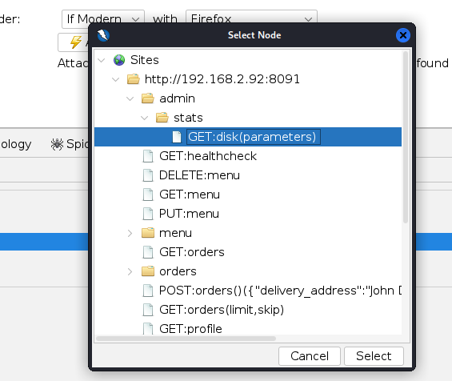
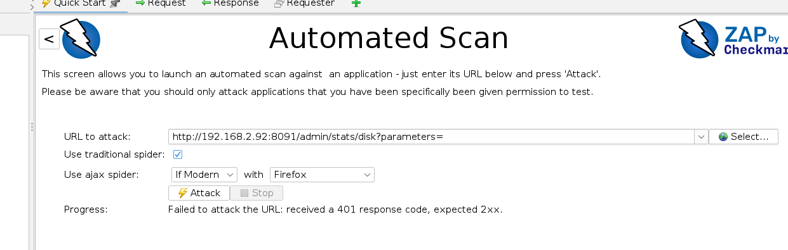
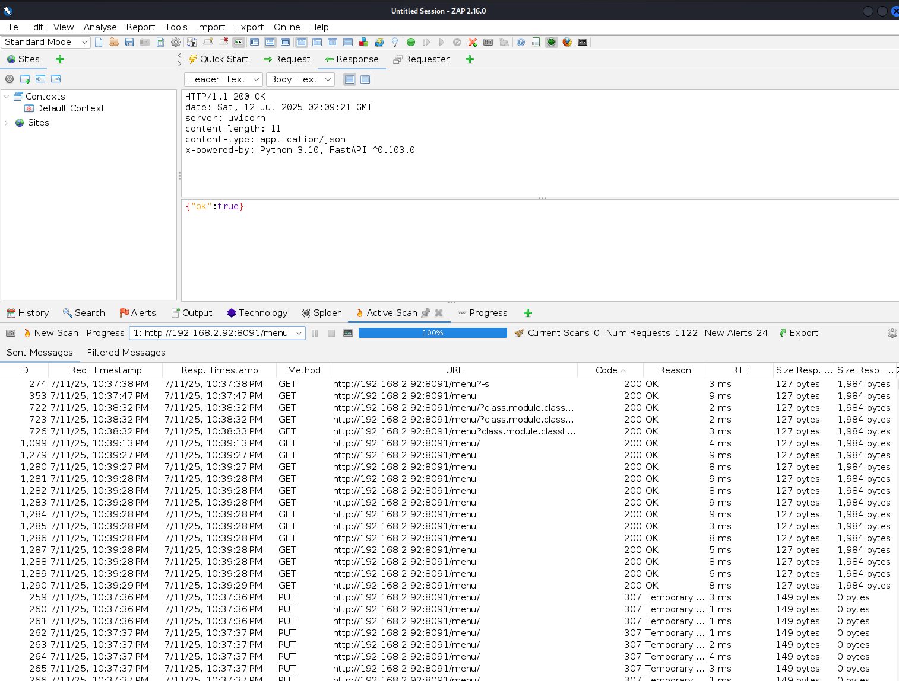
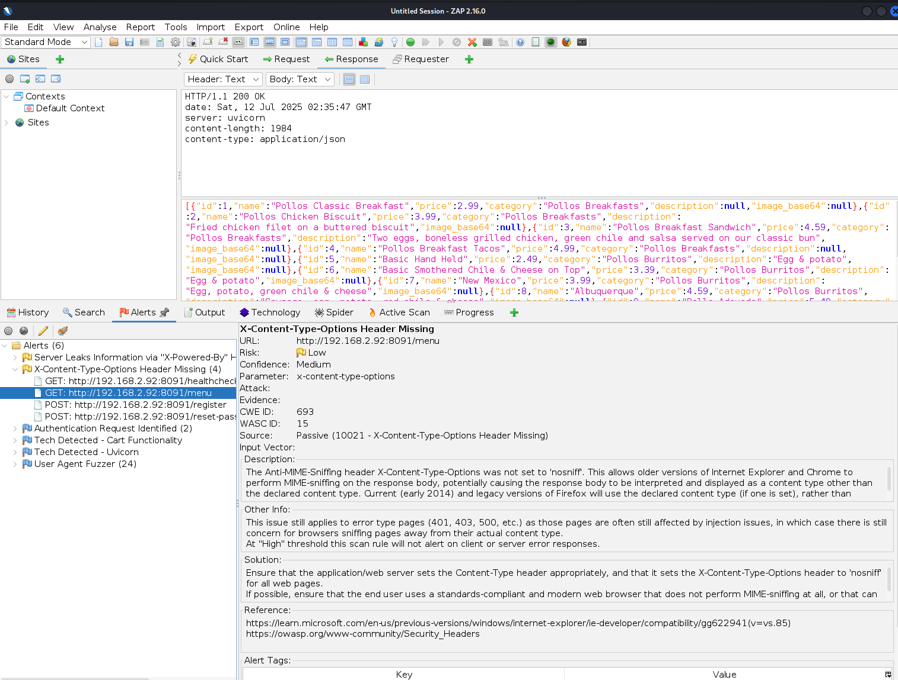
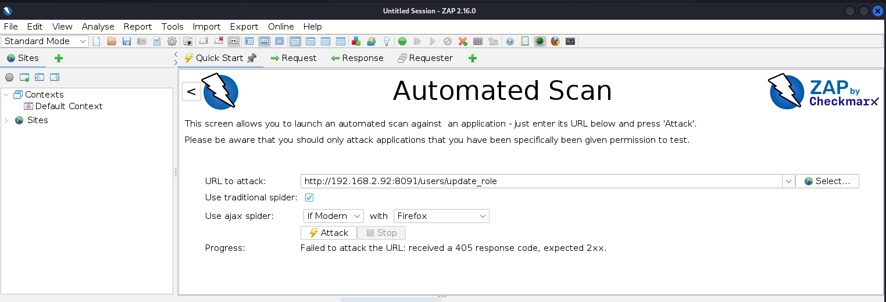
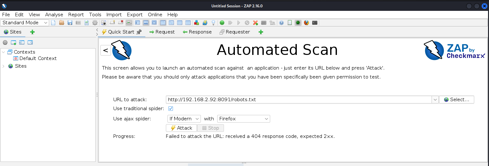

# TRABAJO FINAL DE MÁSTER

## 1. EXPLORACIÓN MANUAL MEDIANTE NAVEGADORES WEB

Para esto se emplearán:

- Mozilla Firefox v115.11.0esr (64-bit)
- Google Chrome v120.0.6099.216 (Build oficial) (64 bits)

Las direcciones que se van a explorar son las siguientes:

- "/" (raíz), normalmente se espera la página de inicio o la redirección a una página de autenticación.
- "/admin": normalmente las apis web tienen una entrada "admin".
- "/docs": el manual de Damn Vulnerable RESTaurant sugiere que aquí hay documentación de la API en Swagger.
- "/redoc": el manual de Damn Vulnerable RESTaurant sugiere que aquí hay documentación de la API en ReDoc.

## 1.1. EXPLORACIÓN MANUAL CON MOZILLA FIREFOX

"/":

"/admin":

"/docs":

"/redoc":

## 1.2. EXPLORACIÓN MANUAL CON GOOGLE CHROME

"/":

"/admin":

"/docs":

"/redoc":

# 1.3. CONCLUSIÓN DE EXPLORACIÓN MANUAL

1. Se pudo obtener la documentación del uso de la API a través de los enlaces /docs y /redoc. Además se puede obtener la especificación OpenAPI, que será muy útil para la sección 2. EXPLORACIÓN CON HERRAMIENTA DE ESCANEO AUTOMATIZADO de este trabajo.

2. Llama la atención aquí es que Firefox incluye dos barras de opciones adicionales para poder interactuar mejor con la API (ver "/" y "/admin").

## 2. EXPLORACIÓN CON HERRAMIENTA DE ESCANEO AUTOMATIZADO

Para este trabajo se empleará ZAP v2.16.0.

### 2.1. CONFIGURACIÓN DE ZAP

Se dejará activado el escáner pasivo, ya que permite realizar una auditoría de forma más rápida y controlada, esto es que en la medida que se avanza manualmente, el escáner pasivo hará tareas en segundo plano para detectar posibles vulnerabilidades. La configuración de este quedará así para este trabajo:

Passive Scan Rules:

- Threshold = Medium para todos los tests, no importando el status (beta, alpha o release).

Passive scan tags:

- Todas habilitadas (enabled).

Passive scanner:

- Solo escanear lo que esté en la cobertura definida (scope).
- No incluirá tráfico del fuzzer durante escaneo pasivo.
- 3 hilos para escaneo pasivo.
- Alertas y tamaño del cuerpo en bytes para escanear sin límites.

### 2.2 IMPORTACIÓN DE OPENAPI.JSON A ZAP

Como la documentación permite obtener este documento y ZAP permite su importación, se realizará para agilizar los ataques.

### 2.3. EXPLORACIÓN DE RUTAS CON ZAP

Las siguientes imágenes muestran los resultados de la exploración con la herramienta ZAP de las rutas proporcionadas por la documentación:

### 2.4. CONCLUSIÓN DE ESCANEO AUTOMATIZADO

- Se encontró que se puede conocer las tecnologías que usa el servicio web, en "/healthchecker".
- En 4 rutas se encontró que la cabecera de X-Content-Type-Options está ausente.
- En la ruta /menu, es posible acceder al menú sin estar autenticado. Puede que sea a propósito para que cualquiera pueda visualizar la página.

## 3. EXPLORACIÓN MANUAL

Se explorarán las ubicaciones dadas en la documentación, realizando consultas y solicitudes HTTP (GET, POST, PUT, DELETE, etc), desde las credenciales con privilegios más bajos (invitado), verificando si hay forma de hacer acciones que no deberían poder hacerse, e intentando hacer ataques de instrusión para buscar acceder al sistema y escalar los privilegios actuales. En caso de que no se haga, se irán explorando usuarios poco a poco hacia niveles más altos para verificar coherencia con sus permisos y buscando lo mismo para el caso del plan ya descrito para el usuario de privilegio de menor importancia.

Para esta exploración de emplea OWASP ZAP v2.16.0.

### 3.1. EXPLORACIÓN DE ENLACES DE UN USUARIO SIN PRIVILEGIOS

Esto es como si fuera un invitado el que estuviera explorando la API.

Se encontró que:

~~~
POST http://192.168.1.47:8091/register
~~~

Es capaz de crear un usuario desde invitado (ningún usuario accedido).

## 4. SSRF

1. Ir a docs. Para mi caso, el servidor está lanzado en la siguiente dirección:

~~~
http://192.168.2.92:8091/docs
~~~

y buscar en la sección "menu" el método "put" para actualizarlo.

2. Intentar ejecutar el método, así se obtiene el comando para curl:

~~~
curl -X 'PUT' \
  'http://localhost:8091/menu' \
  -H 'accept: application/json' \
  -H 'Content-Type: application/json' \
  -d '{
  "name": "string",
  "price": 0,
  "category": "string",
  "image_url": "string",
  "description": "string"
}'
~~~

3. Preparar el comando curl de manera que apunte al servidor y además tenga un token válido como empleado (employee).

El token se obtiene así, para el usuario y contraseña creados en el 

~~~
curl -X 'POST' \
  'http://192.168.2.92:8091/token' \
  -H 'accept: application/json' \
  -H 'Content-Type: application/x-www-form-urlencoded' \
  -d 'grant_type=password&username=customer&password=password&scope=&client_id=string&client_secret=string'
~~~

~~~
curl -X 'PUT' \
  'http://192.168.2.92:8091/menu' \
  -H 'accept: application/json' \
  -H 'Content-Type: application/json' \
  -d '{
  "name": "string",
  "price": 0,
  "category": "string",
  "image_url": "string",
  "description": "string"
}'
~~~

