# TRABAJO FINAL DE MÁSTER

El objetivo es la detección de vulnerabilidades de una API que se usa como ejercicio para practicar y mejorar las habilidades a la hora de buscar y explotar vulnerabilidades. Como la idea es simular un caso de auditoría de la API, en la vida real es importante tener claro los requisitos mínimos para poder iniciarla y una estrategia, ya que el tiempo es algo que apremia y no puede desperdiciarse debido a los costos de operación que implica realizarla.

## 1. PLANIFICACIÓN

### 1.1. REQUISITOS MÍNIMOS

Para poder definirlos, se necesita saber qué es lo que se va a auditar y cuál es el alcance mínimo requerido como requisito. Para este caso, será una API llamada "Damn Vulnerable RESTaurant", una API hecha con vulnerabilidades a propósito para practicar hacking ético. Los datos más relevantes para poder establecer una estrategia son:

- La API está hecha en un framework llamado FastAPI, que usa Python como lenguaje de programación.
- La base de datos está en Postgres.
- Se puede desplegar usando docker compose.

Con estos datos, lo mínimo que se requiere es:

- Un computador que sea capaz de ejecutar Docker. Por practicidad, se utilizará Linux Ubuntu 24.04 como sistema operativo anfitrión.

- Un computador adicional que tenga OWASP ZAP instalado o una máquina virtual con Kali Linux, que ya lo trae por defecto.

- Documentación de las funcionalidades de la API (por ejemplo, Swagger OpenAPI).

Como es un ejercicio de una API pequeña (ver su documentación en el README.md en su repo: https://github.com/theowni/Damn-Vulnerable-RESTaurant-API-Game.git), con un computador con la siguiente configuración es suficiente:

- Hardware: procesador Intel Core i7 10750H, 32 GB de RAM y 240 GB de almacenamiento.
- SO anfitrión: Ubuntu 24.04, con docker y docker compose.
- Máquina virtual con Kali Linux, que ya trae OWASP ZAP, que corre en VirtualBox v7.1.12. Para este trabajo se empleará OWASP ZAP v2.16.0.
- El computador estará conectado a una red LAN gobernada por un router, que le asignará las direcciones IP dinámicamente tanto al anfitrión como a la MV.

### 1.2. ESTRATEGIA DE LA PRUEBA

1. Preparación de la prueba. Se despliega la API con docker compose en el anfitrión. En el mismo computador, se ejecuta una MV con Kali Linux, que ya trae OWASP ZAP.
2. Se hace una exploración manual usando los navegadores Google Chrome y Mozilla Firefox apuntando a unas direcciones definidas.
3. Para el caso de encontrar documentación (Swagger por ejemplo), se intentará descargar la especificación OpenAPI. Si no la tuviere o no se pudiere encontrar, entonces lo que se haría en la vida real sería preguntar sobre el descriptor de la API en un formato estandarizado (OpenAPI).
4. Escaneos automatizados y manuales con OWASP ZAP.
5. Explotación de vulnerabilidades encontradas en el punto 4 y si la explotación lo permite, iterar desde el punto 4 para escalar privilegios en la misma API (tipo de usuario). Se le dará prioridad a aquellas vulnerabilidades que permitan la escalada de privilegios, por ejemplo, que un usuario de cierto rol pueda realizar cosas que no debería.

## 2. EJECUCIÓN DE LA ESTRATEGIA DE LA PRUEBA

### 2.1. PREPARACIÓN DE LA PRUEBA

#### DESPLIEGUE DE LA API

El repo de la API a probar es el siguiente:

~~~
https://github.com/theowni/Damn-Vulnerable-RESTaurant-API-Game.git
~~~

Se realiza la descarga en una carpeta del usuario usando git clone:

~~~
$ git clone https://github.com/theowni/Damn-Vulnerable-RESTaurant-API-Game.git
~~~

Y en la documentación (README.md) aparecen las instrucciones para desplegar la API, pero se realizó una pequeña modificación al docker-compose.yml para que la base de datos quede en la misma carpeta del repo. De esta manera es posible borrarla usando:

~~~
$ sudo rm -r ./postgres_data
~~~

Cada vez que se requiera. Esto se puede hacer cuando la API no está desplegada. PAra el caso en que lo esté, toca desinstalar el despliegue usando:

Usando docker compose v2:
~~~
$ docker compose down
~~~
O usando docker compose v1:
~~~
$ docker-compose down
~~~

#### MÁQUINA VIRTUAL (MV) DE KALI LINUX

Usando VirtualBox v7 se despliega una máquina virtual cuya imagen se puede conseguir en el sitio oficial de Kali Linux. Con 3 núcleos de procesador y 8 GB de RAM se trabaja bien.

### 2.2. EXPLORACIÓN MANUAL MEDIANTE NAVEGADORES WEB

Para esto se emplearán:

- Mozilla Firefox v115.11.0esr (64-bit)
- Google Chrome v120.0.6099.216 (Build oficial) (64 bits)

Las direcciones que se van a explorar son las siguientes:

- "/" (raíz), normalmente se espera la página de inicio o la redirección a una página de autenticación.
- "/admin": normalmente las apis web tienen una entrada "admin".
- "/docs": el manual de Damn Vulnerable RESTaurant sugiere que aquí hay documentación de la API en Swagger.
- "/redoc": el manual de Damn Vulnerable RESTaurant sugiere que aquí hay documentación de la API en ReDoc.

### 2.2.1. EXPLORACIÓN MANUAL CON MOZILLA FIREFOX

"/":

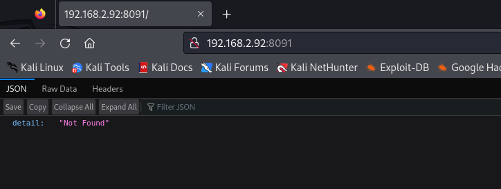

"/admin":

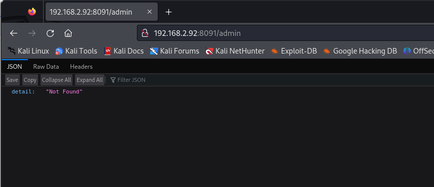

"/docs":

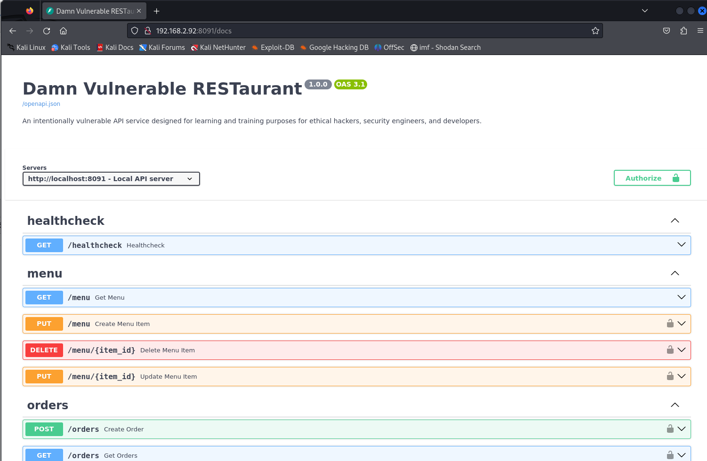

"/redoc":

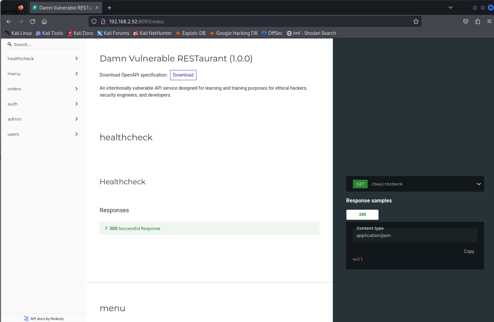

### 2.2.2. EXPLORACIÓN MANUAL CON GOOGLE CHROME

"/":

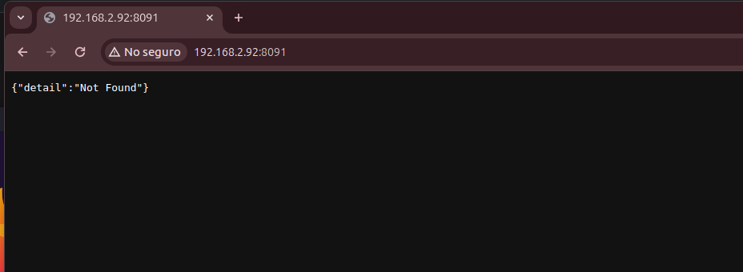

"/admin":

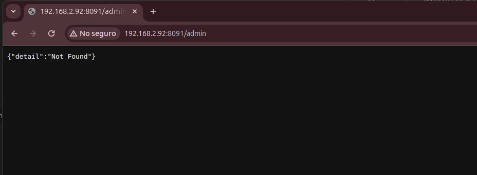

"/docs":

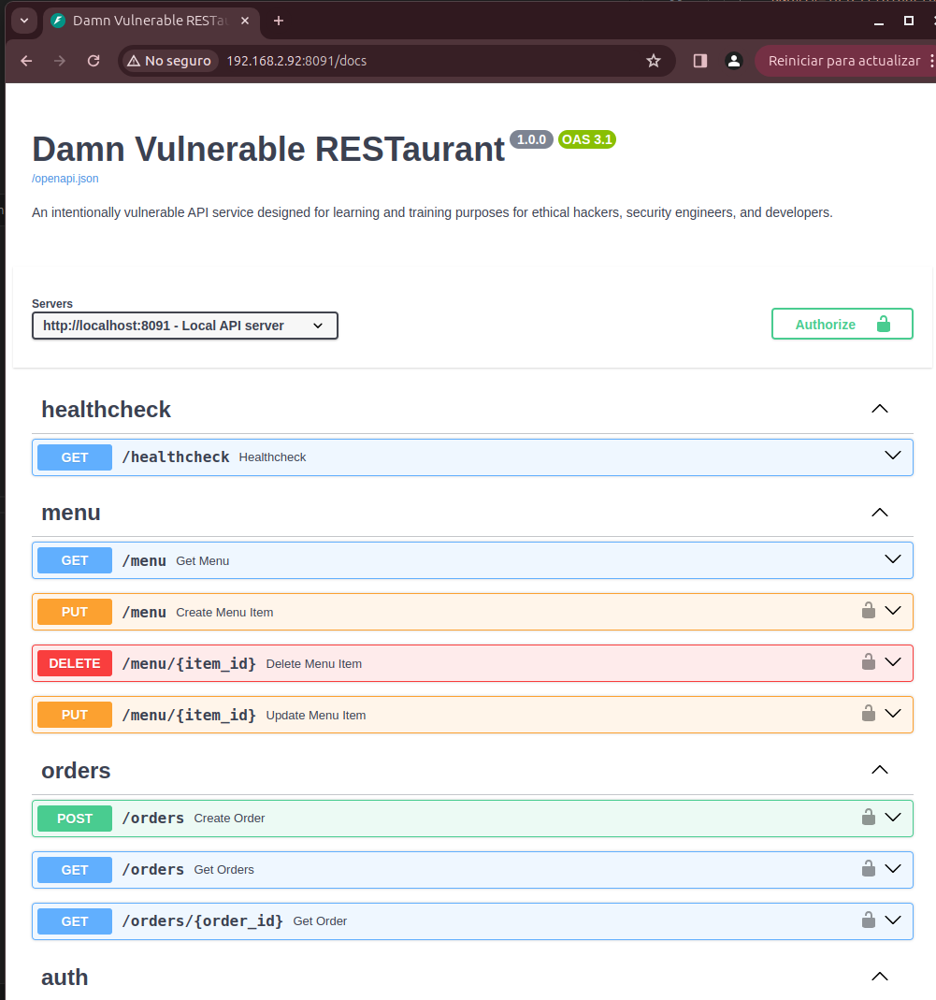

"/redoc":

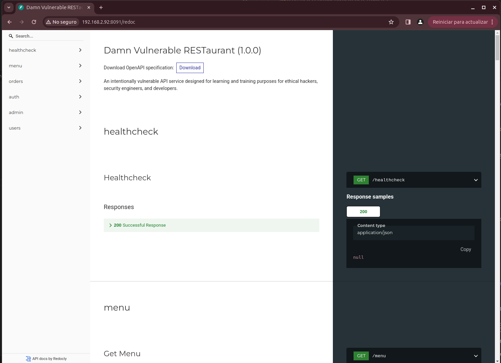

### 2.2.3. CONCLUSIÓN DE EXPLORACIÓN MANUAL

1. Se pudo obtener la documentación del uso de la API a través de los enlaces /docs y /redoc. Además se puede obtener la especificación OpenAPI, que será muy útil para la sección 2.3. EXPLORACIÓN CON HERRAMIENTA DE ESCANEO AUTOMATIZADO INICIAL: ESPECIFICACIÓN DE LA API de este trabajo.

2. Llama la atención aquí es que Firefox incluye dos barras de opciones adicionales para poder interactuar mejor con la API (ver "/" y "/admin").

## 2.3. EXPLORACIÓN CON HERRAMIENTA DE ESCANEO AUTOMATIZADO INICIAL: ESPECIFICACIÓN DE LA API

Para un caso de la vida real la idea es que el equipo de trabajo que desarrolla la API entregue una documentación de esta especificación, ya sea como un archivo, o si es una empresa que sigue los estándares de una API RESTful se pueda conseguir mediante un enlace, por ejemplo "/docs" o "/redoc". Para esta caso en particular, los desarrolladores sí han suministrado este recurso y se puede descargar efectivamente mediante los enlaces "/docs" o "/redoc" (ver README.md de la API), aunque también fueron descubiertos en el punto 2.2 EXPLORACIÓN MANUAL.

## 2.4. ESCANEOS AUTOMATIZADOS Y MANUALES CON OWASP ZAP

OWASP ZAP es el programa principal que se utilizará para realizar la prueba de penetración en esta API, que implica escaneos automatizados y manuales, así como técnicas de escaneo activo (peticiones con con cargas pagas envenenadas), pasivo (solo revisión de vulnerabilidades en cuyas transacciones peticiones-respuesta pueda haber revelación de información delicada, sea técnica por ejemplo Cookie sin HttpOnly o la permitividd de inclusiones de scripts en dominios cruzados, así como secretos).

### 2.4.1. CONFIGURACIÓN DE OWASP ZAP

Lo primero que hay que hacer es configurar el programa para prepararlo para las pruebas. Con esto habrá la seguridad de sobre qué se está trabajando y qué resultados esperarse durante las pruebas, ya que esto define el comportamiento del programa para la realización de estas.

Se dejará activado el escáner pasivo, ya que permite realizar una auditoría de forma más rápida y controlada, esto es que en la medida que se avanza manualmente, el escáner pasivo hará tareas en segundo plano para detectar posibles vulnerabilidades. La configuración de este quedará así para este trabajo:

### 2.4.1.1. PASSIVE SCANNER

#### Passive Scan Rules:

Se dejarán todos los valores por defecto, y esto es:

- Threshold = Medium para todos los tests, no importando el status (beta, alpha o release).

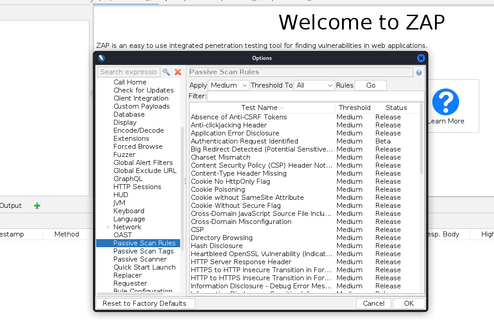

#### Passive scan tags:

Se dejarán todos los valores por defecto, y esto es:

- Todas habilitadas (enabled).

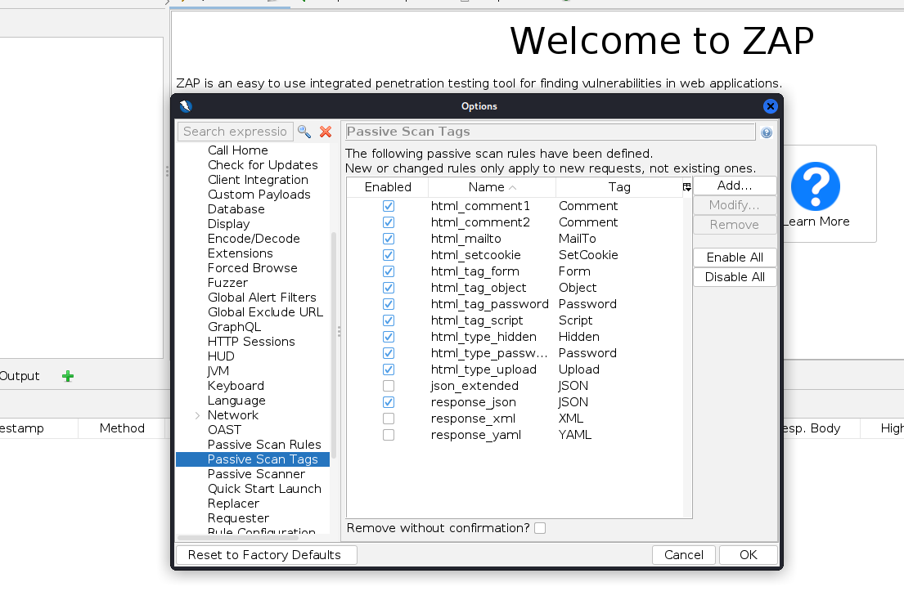

#### Passive scanner:

Se dejarán todos los valores por defecto, y esto es:

- Se ecanearán todos los mensajes (incluso fuera de la cobertura (scope)).
- No incluirá tráfico del fuzzer durante escaneo pasivo.
- 3 hilos para escaneo pasivo.
- Alertas y tamaño del cuerpo en bytes para escanear sin límites.

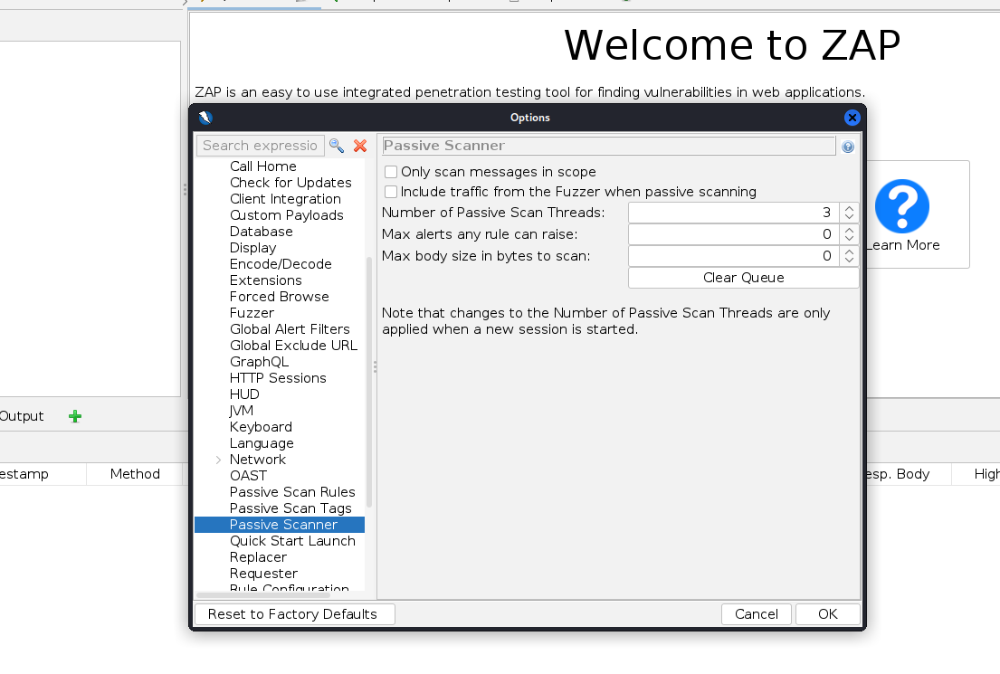

### 2.4.1.2. MODO DE ZAP

Se trabajará en modo estándar (Standard Mode). Se habría podido utilizar el modo de ataque (ATTACK mode), pero habría que estar pendiente de las configuraciones del escáner activo, ya que podría en ciertos casos consumir más recursos de los necesarios, además de que hay que reconocer que se necesita experticia para esto.

### 2.4.1.3. VALUE GENERATOR

Esta configuración es importante también, porque a pesar de que se puede dejar por defecto, añadirle valores puede ayudar a mejorar la auditoría, haciéndola personalizada en las búsquedas y ataques. El add-on OpenAPI, que se usará en el punto 2.3, la usa durante la importación de una definición, otra razón más para configurarla correctamente. Algunos campos que no estén definidos serán rellenados por valores que tiene este generador por defecto en ZAP, por ejemplo "John Due".

### 2.4.1.4. SCRIPTS

Cualquier script generado desde "HTTP Sender" debe estar deshabilitado:

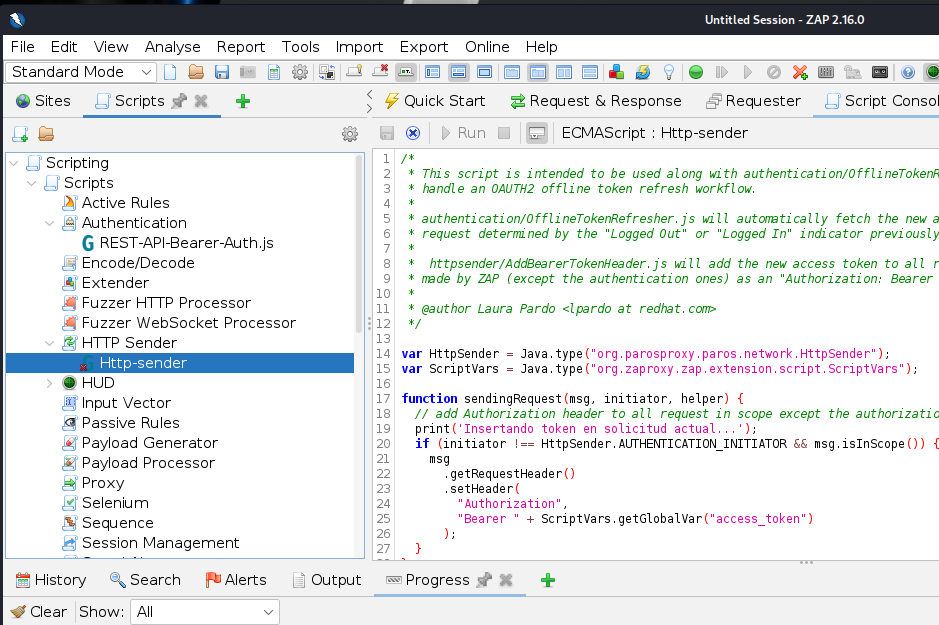

Si no se deshabilita, la API podría interpretarlo como peticiones de un usuario registrado y autorizado. Aquí la idea es hacer las peticiones como si fuera un usuario invitado o no registrado (público).

### 2.4.2 IMPORTACIÓN DE OPENAPI.JSON A ZAP

Como la documentación permite obtener este documento y ZAP permite su importación, se realizará para agilizar los ataques. Durante la auditoría de una API, esto es un requisito mínimo para poder realizarla.

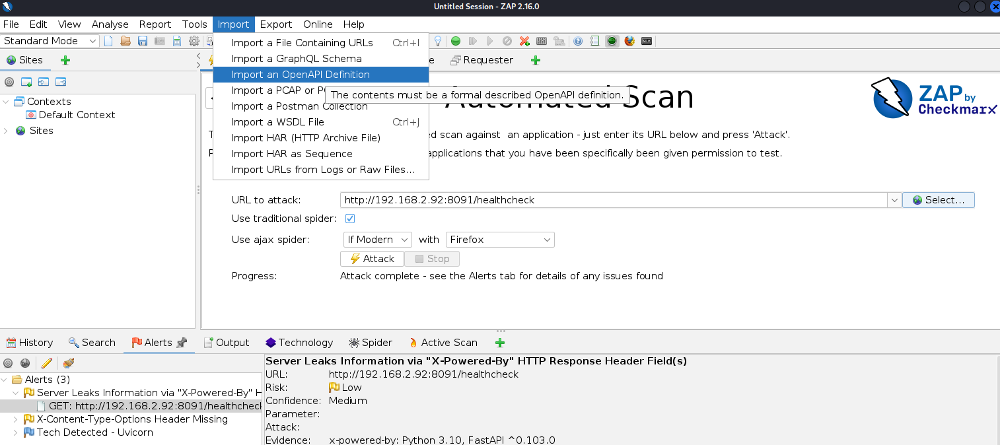

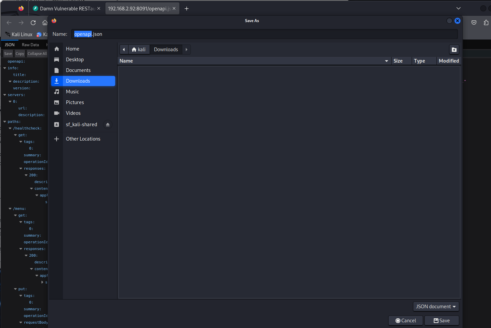

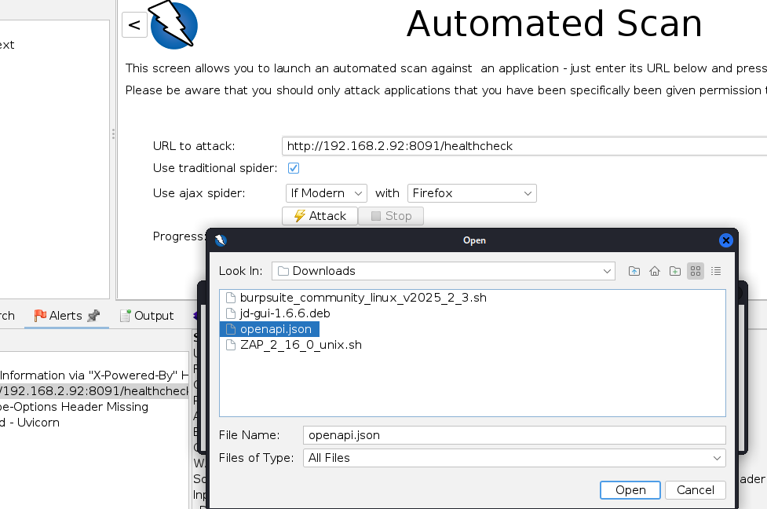

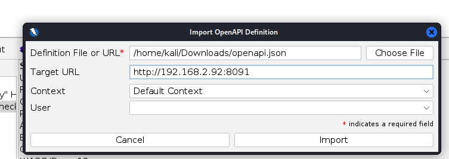

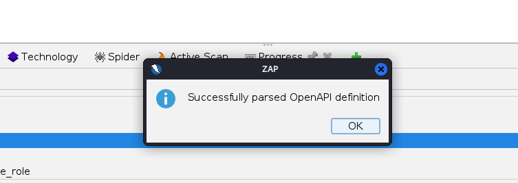

### 2.4.3. ANÁLISIS DEL RESULTADO LA IMPORTACIÓN DE LA ESPECIFICACIÓN DE LA API

Como se había dicho previamente durante la configuración del OWASP ZAP en el punto 2.4.1.3. VALUE GENERATOR, el addon que importa el archivo OpenAPI.json realiza un escaneo activo breve a cada URL descrita en dicho descriptor, lo cual implica que le haya pasado una carga paga envenenada con información, así que es posible que haya podido incluso modificado la información que está almacenada en la base de datos (sea añadido, editado o borrado). Se revisará cada una de las URL, y se revisará qué tipo de respuesta se ha obtenido para cada una, así como las alertas obtenidas predeterminadas.

Lo primero que hay que revisar es ver si en el historial ha habido peticiones que se han respondido satisfactoriamente, es decir, aquellas cuyo código de estado HTTP es 2xx:

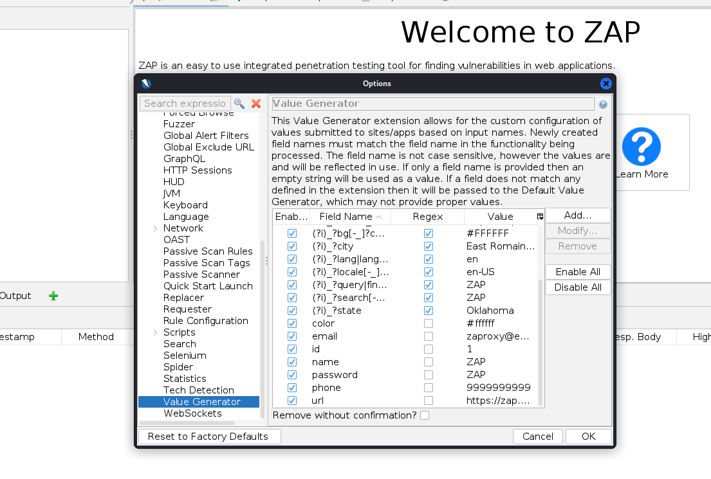

Se pueden ver 4 respuestas con este código. Llama mucho la atención una que tiene código 201 que es cuando se crea una entidad y se almacena en la base de datos. Algunas deberían ser posibles de realizar desde un usuario invitado, pero otras no. Hay que revisar si este es el caso:

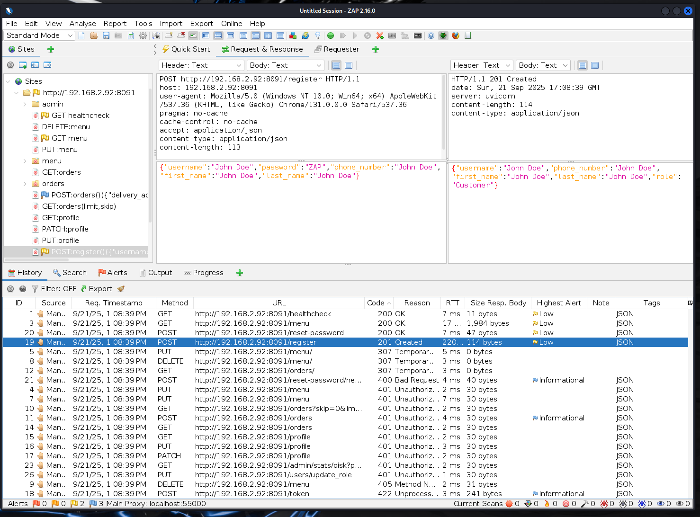

Se puede apreciar que es el registro de un cliente, lo cual es una actividad común y prácticamente fundamental en un programa en el que se gestiona un restaurante, pues cualquiera que esté en Internet podría acceder y tener la capacidad de poder registrarse. Si se tratara de un usuario cuyos privilegios son más altos (por ejemplo un empleado o alguien de cargo más alto, o que tenga más responsabilidad sobre el sistema), sería algo para marcar como una "vulnerabilidad al escalamiento de privilegios". Pero, por defecto, el usuario ha sido designado como cliente.

Analizando las alertas, hay unas que llaman la atención, por ejemplo la tecnología utilizada para el despliegue expuesta en las respuestas. Esto añade información para poder realizar ataques más precisos y menos demorados en alcanzar:

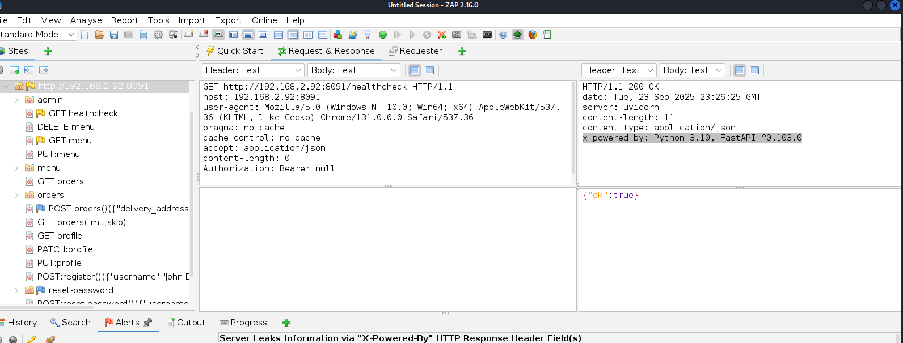

Se tiene entonces que el framework es FastAPI v0.103.0, que trabaja sobre Python v3.10. A continuación, se mostrará la información que hay en https://www.cvedetails.com/ al día de hoy 23 de septiembre de 2025 con respecto a estas tecnologías:

Respecto a FastAPI, no hay vulnerabilidades encontradas para la v0.103.0:

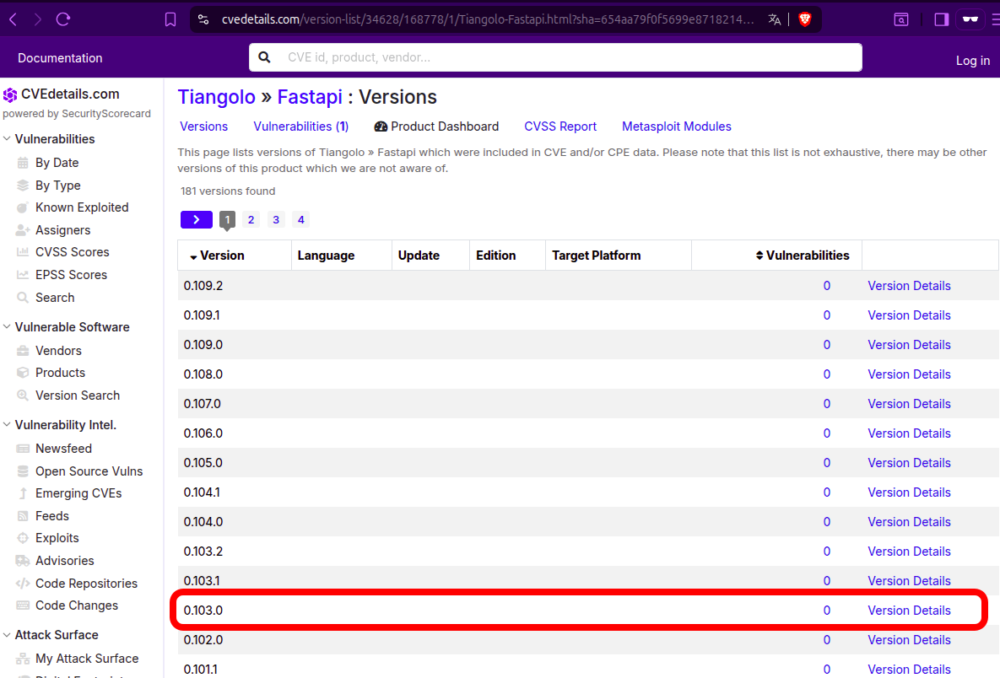

Respecto a Python, no hay resgistro de vulnerabilidades para la v3.10.18:

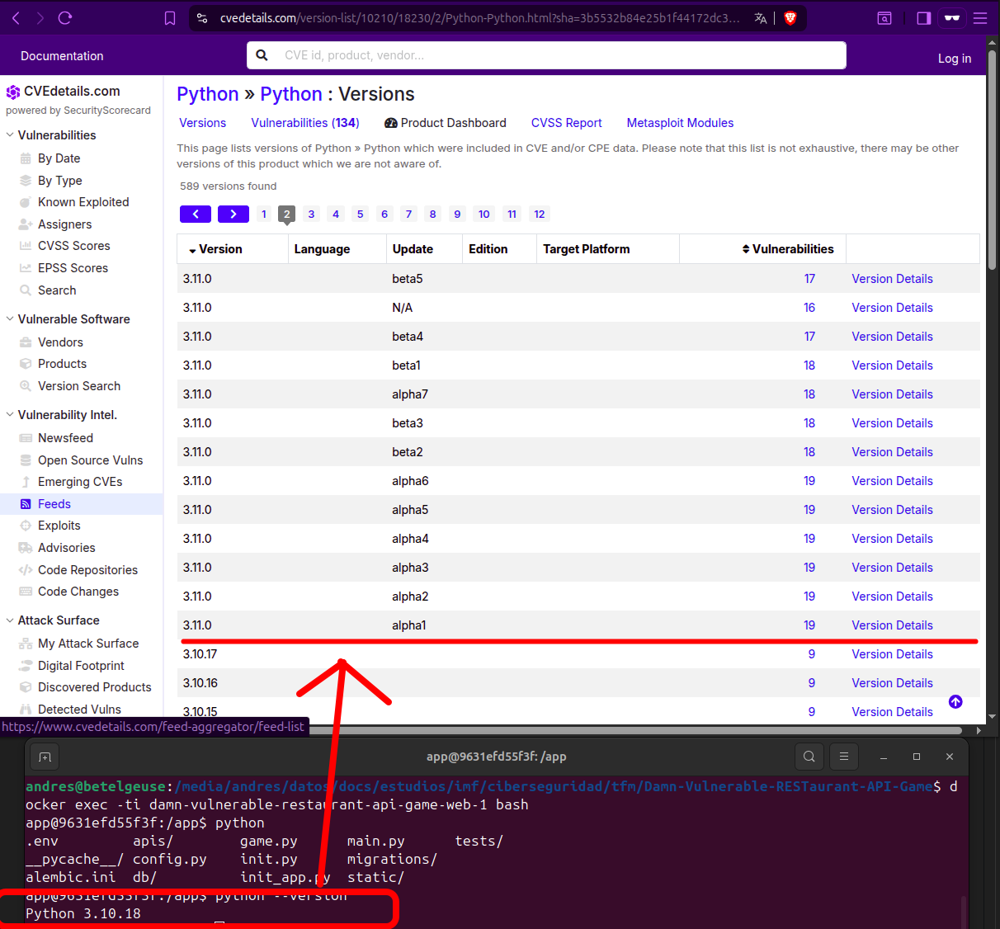

### 2.4.4. EXPLORACIÓN MANUAL DE LAS DIRECCIONES QUE CONTIENEN PARÁMETROS EN LA RUTA DE LA URL EN BÚSQUEDA DE IDOR

Es importante saber si las rutas de URL que apuntan a recursos están seguras. Las rutas de URL que apuntan a recursos tienen el siguiente formato:

~~~
GET dir_web/api/{id_de_recurso}
~~~

Por ejemplo, la siguiente petición debería devolver como resultado una orden cuya id = order_id:

~~~
GET http://192.168.2.92:8091/orders/{order_id}
~~~

Hay casos en los que se puede suceder (y no debería) en los que se puede hacer una solicitud de tipo POST, PUT, DELETE o cualquiera que implique la modficación en la base de datos sin estar autorizados, y a veces sin siquiera preguntar si el usuario está seguro de desear hacerlo. A esto se le conoce como **referencia directa a objeto insegura** o en inglés *Insecure Direct Object Reference* o simplemente el acrónimo **IDOR**. Si fuera una API más grande, valdría la pena automatizar el proceso para que el escáner activo las busque por nosotros, pero como son pocas las direcciones que permiten realizar esta operación, esto se hará manualmente.

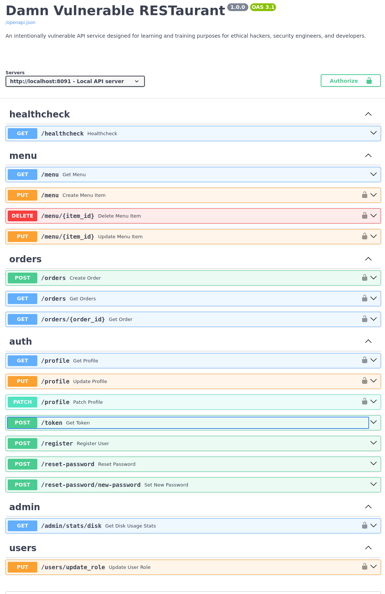

De la imagen anterior se deducen las siguientes funciones:

~~~
DELETE /menu/{item_id}
PUT /menu/{item_id}
GET /orders/{order_id}
~~~

Aunque son más de interés aquellas que modifiquen datos en la BB.DD., se harán también las que se hagan con GET. Esto es porque para cuando se haga el escaneo activo, el programa sepa de antemano que hay direcciones que se pueden atacar con solo ponerle el id del recurso.

Se aprovechará la misma carga paga en el cuerpo que se le ha enviado en el momento de hacer la importación del descriptor de la API.

Resultado para DELETE /menu/{item_id}:

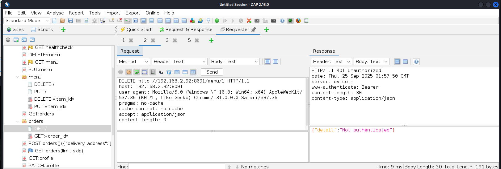

Resultado para PUT /menu/{item_id}

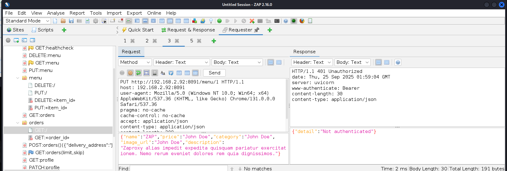

Resultado para GET /orders/{order_id}

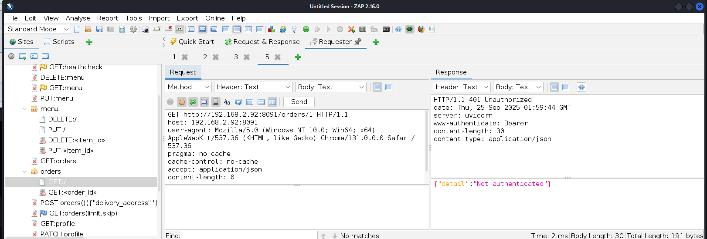

Como se ha podido ver, ninguna petición ha sido aprobada por falta de autenticación y, por ende, de autorización.

### 2.4.5. ESCANEO ACTIVO DE LA API

Este es un buen momento para hacer un escaneo activo, ya que hay suficientes recursos a probar, y que el programa ya los conoce de antemano. Pero antes, hay que hacer algunas configuraciones al programa para hacer que el escaneo sea breve, pero efectivo.

#### 2.4.5.1. CONFIGURACIÓN DE OWASP ZAP ANTES DEL ESCANEO ACTIVO

Las configuraciones son las siguientes:

1. Todas las rutas por debajo de http://192.168.2.92:8091 (donde se desplegó la API) estarán en el contexto por defecto (default context):

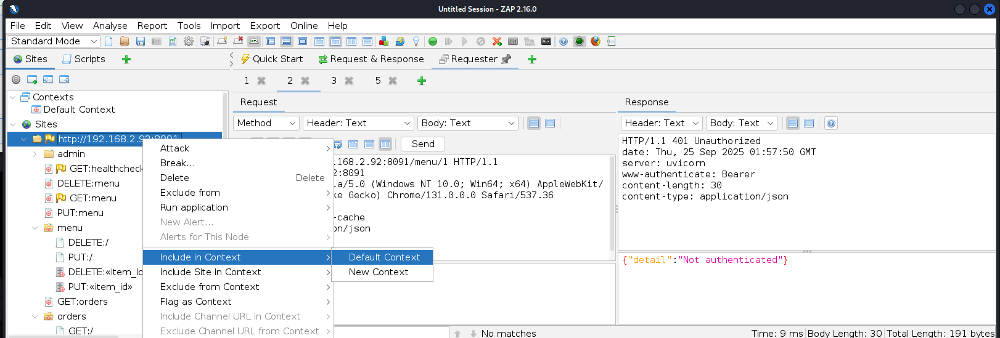
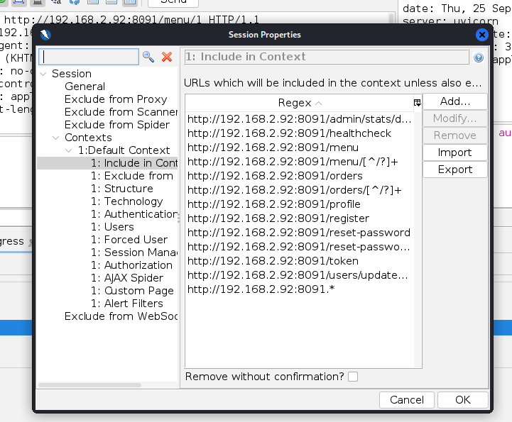

2. El contexto por defecto tendrá configurada la sección de tecnología (technology) así:

- Para DB, PostgreSQL.
- Para el lenguaje, Python.
- Para OS, Linux.
- La gestión de código fuente (SCM) y el servidor web (WS) se dejaran por defecto activos todos.

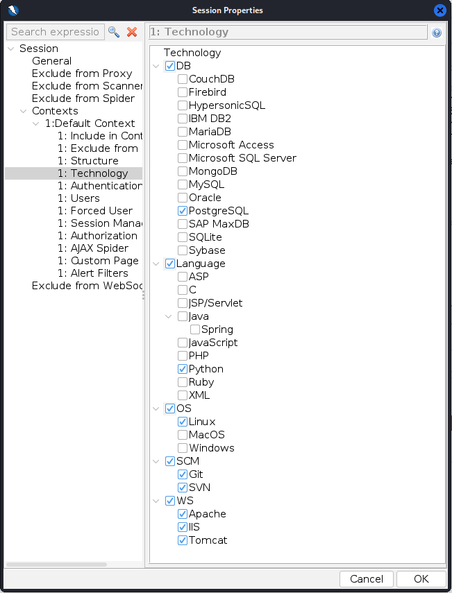

Con esto se reduce la cantidad de peticiones y el tiempo de la prueba, ya que se reduce a una cobertura más precisa con relación a la API.

3. El escáner activo usará la política de escaneo "API". Con esto se reduce aún más el tiempo y la cobertura se vuelve más precisa de cara a la prueba de la API, ya que no será necesario realizar pruebas relacionadas con un navegador web (nodo de cliente).

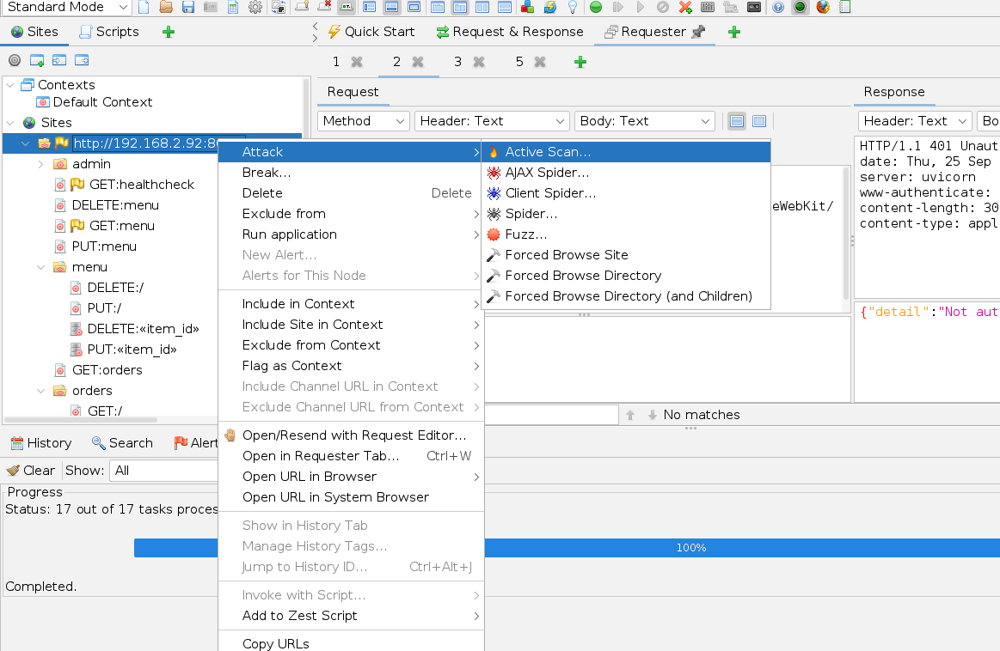
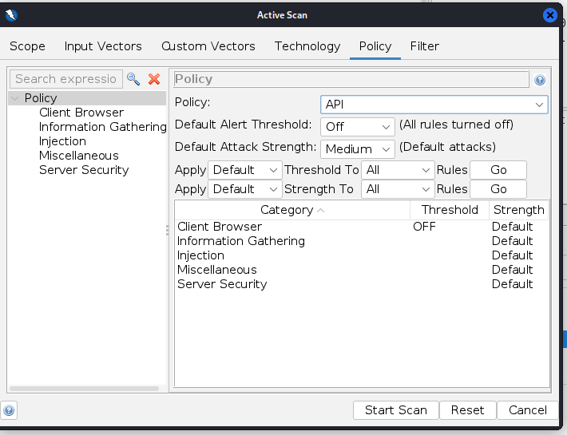

La cobertura (scope) del escaneo quedará entonces en el contexto por defecto, ya configurado previamente, y el escaneo será recursivo, para que explore todos los enlaces que tiene por debajo (recurse):

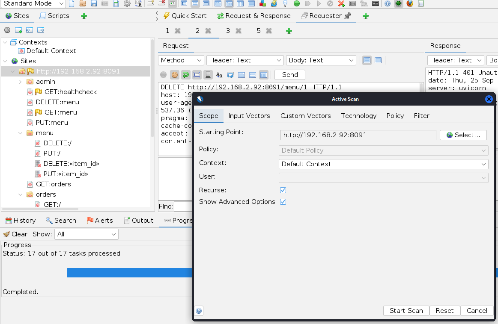

#### 2.4.5.2. PRIMER ESCANEO ACTIVO

Una vez hecho esto, ya el programa estará preparado para el escaneo como se desea. A continuación, se muestran dos resúmenes gráficos del escaneo activo:

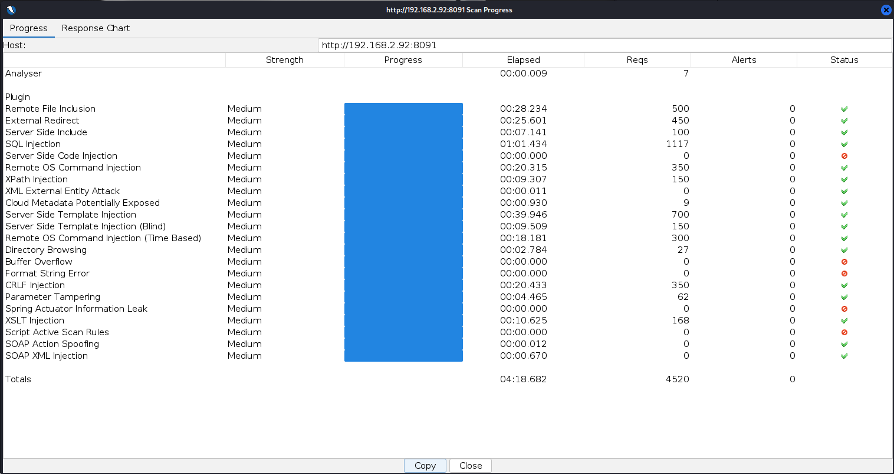

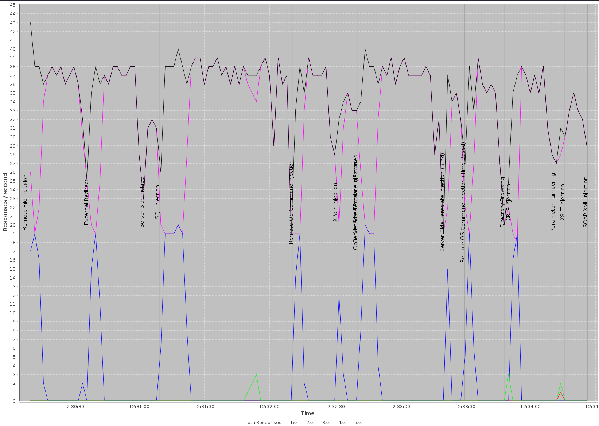

De la imagen donde está la gráfica de r/s contra tiempo, están graficadas los 5 tipos de respuestas HTTP, que van de 1xx a 5xx. Se pondrá más atención a aquellas que son 2xx (verde), ya que significa que hubo peticiones que se respondieron correctamente y 5xx (rojo), que son aquellas que el servidor no pudo manejar al punto de ocasionarle un error interno.

Para el caso de las 2xx, es para ver si dichas peticiones tienen correspondencia con lo que está autorizado para el usuario invitado:

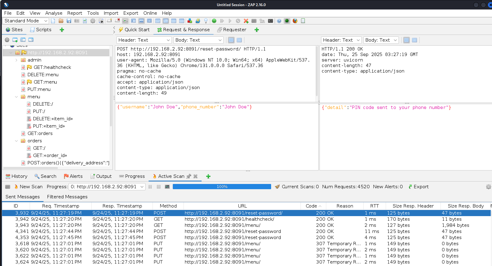

De las peticiones que implican modificación (POST), aquellas que respondieron con 2xx simplemente ha sido una notificación para validar el cambio de la contraseña.

Para el caso de las 5xx, es para ver si existe la posibilidad de que haya una vulnerabilidad que podría ser grave, al punto de poder efectuar incluso cambios en el sistema (ejecuciones con privilegios demasiado altos).

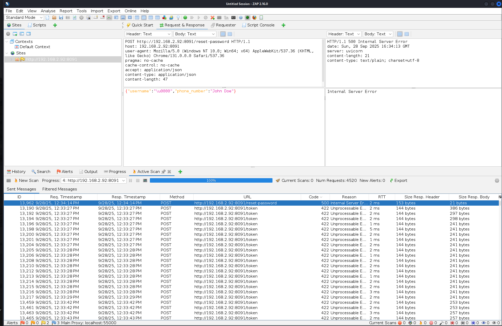

Solo hubo una petición, y no se le ha inyectado ninguna carga paga que implique una inyección de comandos, ni de SQL. Solo parece que no pudo manejar el valor "\u0000" en username, que sería una nota a tener en cuenta para que se mejore la presentación de la API. Se emitirá una alerta de información para que cuando se genere el reporte, aparezca.

#### 2.4.5.3. CREACIÓN DE ALERTA MANUAL

En el punto anterior se evidenció un error interno en el servidor porque no fue capaz de manejar correctamente un campo en la api que permite reiniciar la contraseña. Para la generación de una alerta, se siguen los siguientes pasos:

Se crea la nueva alerta:
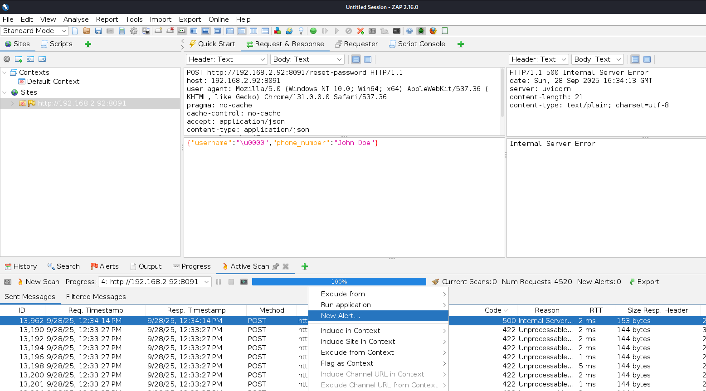

Se especifica de qué se trata, parámetros y la evidencia.:
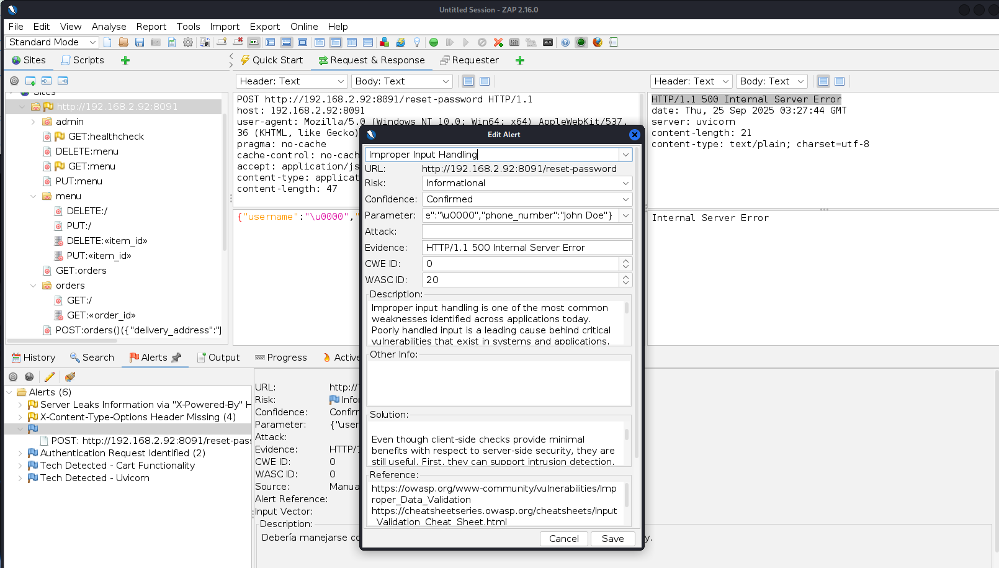

En la lista de alertas (Alerts) debe aparecer como una con bandera azul, ya que es a modo de información:
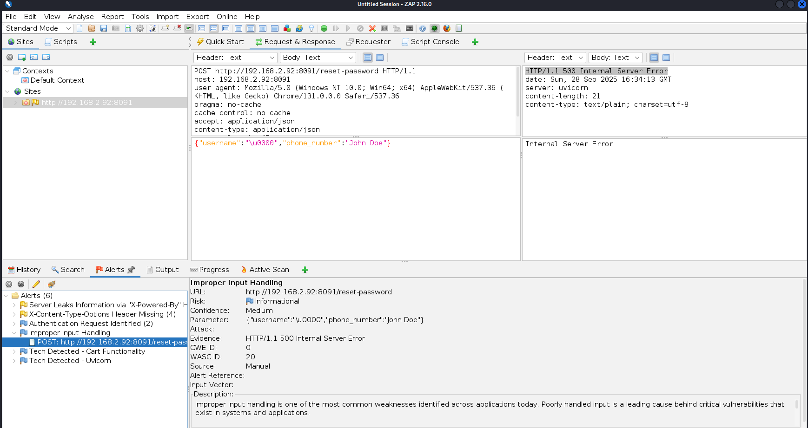

### 2.4.6. PERSISTENCIA DE LA SESIÓN

Cuando se inició este proyecto, no se había considerado el hecho de persistir la sesión, pero dado a que ya hay mucho trabajo realizado, vale la pena guardar los cambios hechos en una sesión, que seguirá creciendo en la medida que se sigan creando y ejecutando más pruebas, así como alertas para el reporte final.

Paso 1:
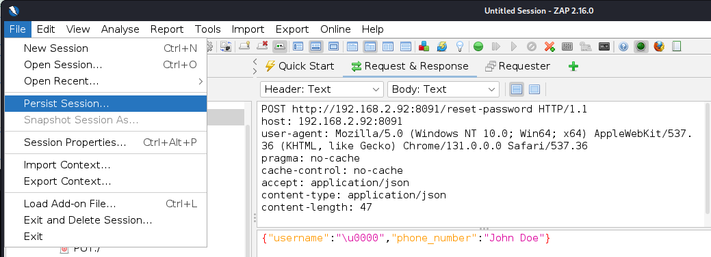
Paso 2:
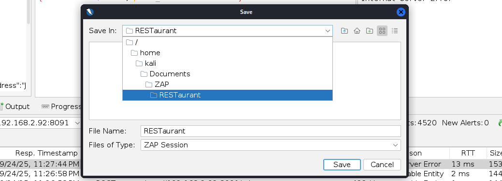
Paso 3:
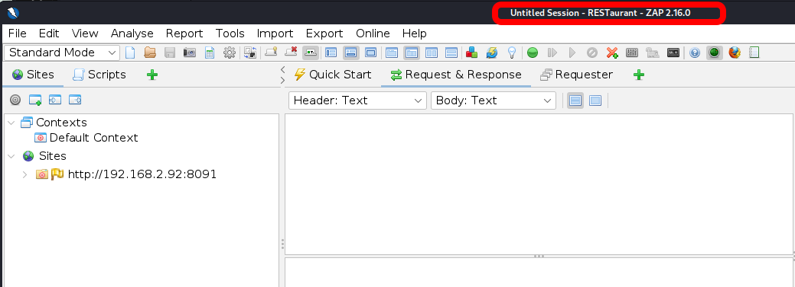

### 2.4.7. EXPLORACIÓN DE LA API DESDE UN USUARIO CON ROL "CUSTOMER"

A partir de este momento, se revisará cuál es el alcance de un usuario cliente o "Customer", accediendo como este y explorando todos los enlaces de la API, a ver si se encuentra una abertura hacia una escalada de privilegios.

En el punto 2.4.3. ANÁLISIS DEL RESULTADO LA IMPORTACIÓN DE LA ESPECIFICACIÓN DE LA API se ha creado un usuario de rol "customer", cuando se realizó la importación del descriptor de la API en OpenAPI, cuyos campos y valores respectivos son:

~~~
{"username":"John Doe","phone_number":"John Doe","first_name":"John Doe","last_name":"John Doe","role":"Customer"}
~~~

Para poder realizar las peticiones desde el usuario "John Doe" que es de rol "Customer" usando las herramientas como el escaneo activo o el fuzzer, hay que configurar el programa primero, y se hace siguiendo el siguiente procedimiento:

1. Identificar método de autenticación: esto es crucial, ya que de este depende la estrategia que se diseñará para el punto 2.
2. Crear 2 scripts: uno de autenticación (basado en Authentication) y otro de emisor de mensajes (basado en HTTP Sender).
3. Configurar la sesión actual: la sesión actual tiene un contexto por defecto, que lo único que se le ha hecho es añadirle las direcciones provistas por el descriptor de la API previamente importado en el punto 2.4.2. Se creará un contexto llamado "Customer", que permitirá hacer peticiones desde un usuario "Customer" en este caso llamado "John Doe". Entonces se le añadirán las direcciones de la API, y se configurará la autenticación (Authentication), los usuarios (Users), el usuario forzado (Forced User) y la gestión de la sesión (Session Management).

#### 2.4.5.1. MÉTODO DE AUTENTICACIÓN

Para conocer cómo funciona este método, se revisará en la documentación (/docs o /redoc) cuál es la funcionalidad que permite la autenticación. Si se exploran las API, hay una que se llama "auth" y seguramente debe tener esta funcionalidad, es decir, que pida un usuario y contraseña como argumentos. Para este caso, la que coincide con estas características es la función "token", de tipo "POST":

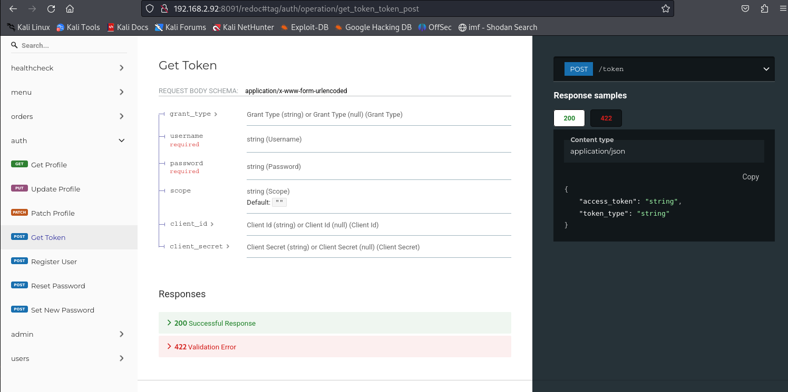

Esta operación se hace manual, utilizando el solicitador de peticiones de OWASP ZAP (Requester). Lo que se hará es enviar una solicitud, utilizando de plantilla la que ya envió por primera vez cuando se importó el descriptor de la API. Ya había lanzado un error, pues las credenciales no coincidían:

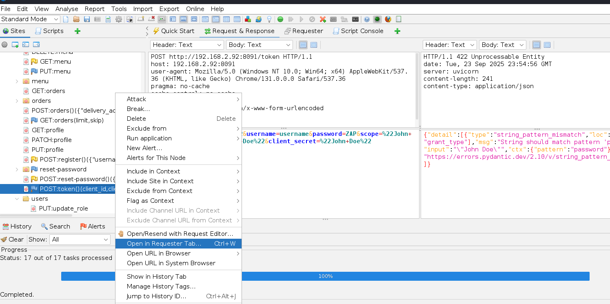

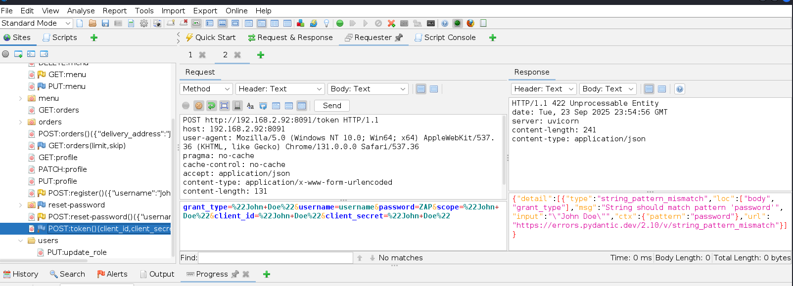

Se aprecia que el cuerpo está codificado como application/x-www-form-urlencoded. Se modificará el cuerpo para poner las credenciales de "John Doe" y para corregir el "grant_type", que puede ser con una cadena de caracteres con valor "password". Se empleará el cuerpo (Body) en forma de tabla (Table) para que sea más cómoda la edición. Una vez editado, al hacer clic en "Send" se tiene la siguiente respuesta:

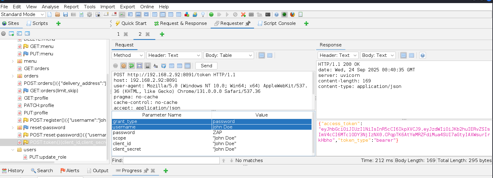

Es como dice en la documentación. Se recibieron 2 cadenas de caracteres (strings), una llamada "access_token" y otra llamada "token_type". Entonces se tiene que el método de autenticación se hace solicitando un token de tipo **"bearer"**, lo cual indica que lo más probable es que se esté utilizando el framework de autenticación **OAuth 2.0**. Sabiendo esto, el plan para el punto 2 es utilizar un script que sea capaz de manejar tokens tipo bearer.

#### 2.4.5.2. CREACIÓN DE SCRIPTS PARA AUTOMATIZAR LA AUTENTICACIÓN Y ENVÍO DE MENSAJES AUTENTICADOS CON BEARER

Esto se hace a través de dos scripts:

1. Está basado en Authentication, y se va a llamar "REST-API-Bearer_auth.js". Este se va a ejecutar cada vez que se haga una solicitud a la API.
2. Está basado en HTTP Sender que se va a llamar "Http-sender".

#### CREACIÓN DE "REST-API-Bearer_auth.js"

Para este, se va a usar de referencia el script "OfflineTokenRefresh.js", que está en el repo "https://github.com/zaproxy/community-scripts", exactamente en la siguiente URL: https://github.com/zaproxy/community-scripts/blob/main/authentication/OfflineTokenRefresh.js

En este repositorio se encuentran scripts muy útiles para este tipo de situaciones, cuyas plantillas ya están predefinidas en el programa.

Se realizaron algunas modificaciones, como en los logs en consola y la edición de los campos, ya que no son los mismos para esta API. Parte del encabezado, así como las funciones "getLoggedInIndicator" y "getLoggedOutIndicator" fueron realizadas por la IA DeepSeek. Con estas dos funciones se le hace saber al programa cuándo el usuario está o no autorizado por acceso (logged in). El script quedó así:

~~~
// The authenticate function will be called for authentications made via ZAP.

// The authenticate function is called whenever ZAP requires to authenticate, for a Context for which this script
// was selected as the Authentication Method. The function should send any messages that are required to do the authentication
// and should return a message with an authenticated response so the calling method.
//
// NOTE: Any message sent in the function should be obtained using the 'helper.prepareMessage()' method.
//
// Parameters:
//		helper - a helper class providing useful methods: prepareMessage(), sendAndReceive(msg), getHttpSender()
//		paramsValues - the values of the parameters configured in the Session Properties -> Authentication panel.
//					The paramsValues is a map, having as keys the parameters names (as returned by the getRequiredParamsNames()
//					and getOptionalParamsNames() functions below)
//		credentials - an object containing the credentials values, as configured in the Session Properties -> Users panel.
//					The credential values can be obtained via calls to the getParam(paramName) method. The param names are the ones
//					returned by the getCredentialsParamsNames() below

/*
 * This script is intended to be used along with  httpsender/AddBearerTokenHeader.js  to
 * handle an OAUTH2 offline token refresh workflow.
 *
 * authentication/OfflineTokenRefresher.js will automatically fetch the new access token for every unauthorized
 * request determined by the "Logged Out" or "Logged In" indicator previously set in Context -> Authentication.
 *
 *  httpsender/AddBearerTokenHeader.js  will add the new access token to all requests in scope
 * made by ZAP (except the authentication ones) as an "Authorization: Bearer [access_token]" HTTP Header.
 *
 * @author Laura Pardo <lpardo at redhat.com>
 */

/*
 * Modificado por Andrés E. Torres H., para probar la API Damn Vulnerable RESTaurant,
 * para el trabajo de grado de la maestría en ciberseguridad con IMF SE, Deloitte y la U. Católica de Ávila.*/

// Acceso directo a funciones importadas:
var HttpRequestHeader = Java.type(
  "org.parosproxy.paros.network.HttpRequestHeader"
);
var HttpHeader = Java.type("org.parosproxy.paros.network.HttpHeader");
var URI = Java.type("org.apache.commons.httpclient.URI");
var ScriptVars = Java.type("org.zaproxy.zap.extension.script.ScriptVars");

function authenticate(helper, paramsValues, credentials) {
	print("[API Auth] Starting authentication...");

  // 1. BUILD THE LOGIN REQUEST
  // Obtener URL desde la interfaz gráfica de las propiedades de la sesión en el programa:
  var loginUrl = paramsValues.get('TargetURL');
  // Construir el cuerpo de la solicitud:
  var requestBody = "grant_type=password";
  requestBody += "&username=" + credentials.getParam('username').replaceAll(' ', '+');
  requestBody += "&password=" + credentials.getParam('password');
  requestBody += "&scope=" + "%22John+Doe%22";
  requestBody += "&client_id=" + "%22John+Doe%22";
  requestBody += "&client_secret=" + "%22John+Doe%22";

  // Mostrar en la consola la URL de acceso del usuario y el contenido a enviar:
  print('Login URL: ' + loginUrl);
  print('Credentials:' + requestBody);

  // Construir mensaje HTTP:
  var msg = helper.prepareMessage();
  msg.setRequestBody(requestBody);
  var RequestHeader = new HttpRequestHeader(
    'POST',
    new URI(loginUrl),
    HttpHeader.HTTP11
  );
  // Configurar encabezado para la solicitud de acceso:
  msg.setRequestHeader(RequestHeader);
  msg.getRequestHeader().setHeader('content-type', 'application/x-www-form-urlencoded');
  msg.getRequestHeader().setHeader('accept', 'application/json');
  msg.getRequestHeader().setContentLength(msg.getRequestBody().length());
  // Enviar mensaje y recibir su respuesta:
  print('Enviado: ' + msg.getRequestHeader() + msg.getRequestBody());
  helper.sendAndReceive(msg);
  print('\n\nRecibido: ' + msg.getResponseHeader());
  print("Auth Response Status: " + msg.getResponseHeader().getStatusCode());

  // 2. EXTRACT THE TOKEN FROM THE JSON RESPONSE
  var responseBody = msg.getResponseBody().toString();
  // Mostrar contenido de la respuesta:
  print("Auth Response Body: " + responseBody);

  try {
    var json = JSON.parse(responseBody);
    // Validar recepción del token:
    var authToken = json.access_token || json.token || json.jwt;
    if (!authToken) {
      throw new Error("Token not found in the expected JSON field.");
    }
    print("Successfully extracted Bearer Token.");
    // Guardar token en una variable global. Esto es para que el script "Http-sender" lo use en sus peticiones de acceso:
    ScriptVars.setGlobalVar("access_token", authToken);
    // 3. RETURN THE VALUE FOR THE AUTHORIZATION HEADER
    return msg;
  } catch (err) {
    print("ERROR: Failed to parse JSON or find token: " + err.message);
    return null;
  }
}

// This function is called during the script loading to obtain a list of the names of the required configuration parameters,
// that will be shown in the Session Properties -> Authentication panel for configuration. They can be used
// to input dynamic data into the script, from the user interface (e.g. a login URL, name of POST parameters etc.)
function getRequiredParamsNames(){
	return ["TargetURL"];
}

// This function is called during the script loading to obtain a list of the names of the optional configuration parameters,
// that will be shown in the Session Properties -> Authentication panel for configuration. They can be used
// to input dynamic data into the script, from the user interface (e.g. a login URL, name of POST parameters etc.)
function getOptionalParamsNames(){
	return [];
}

// This function is called during the script loading to obtain a list of the names of the parameters that are required,
// as credentials, for each User configured corresponding to an Authentication using this script 
function getCredentialsParamsNames(){
  // Solo se requiere el usuario y la constraseña para el acceso:
	return ["username", "password"];
}

// This optional function is called during the script loading to obtain the logged in indicator.
// NOTE: although optional this function must be implemented along with the function getLoggedOutIndicator().
function getLoggedInIndicator() {
  // A successful API call often returns 200/201/204.
  // This regex is a broad indicator of "not an auth error".
  return "\"status\":? ?200|HTTP/1.1 20[0-4]";
}

// Tell ZAP how to know if a request was made without being authenticated.
function getLoggedOutIndicator() {
  // This is critical. Use the exact error your API returns on auth failure.
  return "HTTP/1.1 401|HTTP/1.1 403|\"error\":? ?\"Unauthorized\"";
}
~~~

#### CREACIÓN DE "Http-sender.js"

Para este se usó de referencia AddBearerTokenHeader.js, del repo "https://github.com/zaproxy/community-scripts", ya que como lo sugiere el script original "authentication/OfflineTokenRefresher.js" ahora llamado "REST-API-Bearer_auth.js", se usa en conjunto con este. Algunas cosas se modificaron para acomodarlas a este trabajo, y quedó finalmente así:

~~~
/*
 * This script is intended to be used along with authentication/OfflineTokenRefresher.js to
 * handle an OAUTH2 offline token refresh workflow.
 *
 * authentication/OfflineTokenRefresher.js will automatically fetch the new access token for every unauthorized
 * request determined by the "Logged Out" or "Logged In" indicator previously set in Context -> Authentication.
 *
 *  httpsender/AddBearerTokenHeader.js will add the new access token to all requests in scope
 * made by ZAP (except the authentication ones) as an "Authorization: Bearer [access_token]" HTTP Header.
 *
 * @author Laura Pardo <lpardo at redhat.com>
 */

 /*
 * Modificado por Andrés E. Torres H., para probar la API Damn Vulnerable RESTaurant,
 * para el trabajo de grado de la maestría en ciberseguridad con IMF SE, Deloitte y la U. Católica de Ávila.*/

var HttpSender = Java.type("org.parosproxy.paros.network.HttpSender");
var ScriptVars = Java.type("org.zaproxy.zap.extension.script.ScriptVars");

function sendingRequest(msg, initiator, helper) {
  // add Authorization header to all request in scope except the authorization request itself
  print('Insertando token en solicitud actual...');
  if (initiator !== HttpSender.AUTHENTICATION_INITIATOR && msg.isInScope()) {
    msg
      .getRequestHeader()
      .setHeader(
        "Authorization",
        "Bearer " + ScriptVars.getGlobalVar("access_token")
      );
  }
}

function responseReceived(msg, initiator, helper) {}
~~~

#### 2.4.5.3. CONFIGURAR LA SESIÓN ACTUAL

## 3. EXPLORACIÓN MANUAL

Se explorarán las ubicaciones dadas en la documentación, realizando consultas y solicitudes HTTP (GET, POST, PUT, DELETE, etc), desde las credenciales con privilegios más bajos (invitado), verificando si hay forma de hacer acciones que no deberían poder hacerse, e intentando hacer ataques de instrusión para buscar acceder al sistema y escalar los privilegios actuales. En caso de que no se haga, se irán explorando usuarios poco a poco hacia niveles más altos para verificar coherencia con sus permisos y buscando lo mismo para el caso del plan ya descrito para el usuario de privilegio de menor importancia.

Para esta exploración de emplea OWASP ZAP v2.16.0.

### 3.1. EXPLORACIÓN DE ENLACES DE UN USUARIO SIN PRIVILEGIOS

Esto es como si fuera un invitado el que estuviera explorando la API.

Se encontró que:

~~~
POST http://192.168.1.47:8091/register
~~~

Es capaz de crear un usuario desde invitado (ningún usuario accedido).

## 4. SSRF

1. Ir a docs. Para mi caso, el servidor está lanzado en la siguiente dirección:

~~~
http://192.168.2.92:8091/docs
~~~

y buscar en la sección "menu" el método "put" para actualizarlo.

2. Intentar ejecutar el método, así se obtiene el comando para curl:

~~~
curl -X 'PUT' \
  'http://localhost:8091/menu' \
  -H 'accept: application/json' \
  -H 'Content-Type: application/json' \
  -d '{
  "name": "string",
  "price": 0,
  "category": "string",
  "image_url": "string",
  "description": "string"
}'
~~~

3. Preparar el comando curl de manera que apunte al servidor y además tenga un token válido como empleado (employee).

El token se obtiene así, para el usuario y contraseña creados en el 

~~~
curl -X 'POST' \
  'http://192.168.2.92:8091/token' \
  -H 'accept: application/json' \
  -H 'Content-Type: application/x-www-form-urlencoded' \
  -d 'grant_type=password&username=customer&password=password&scope=&client_id=string&client_secret=string'
~~~

~~~
curl -X 'PUT' \
  'http://192.168.2.92:8091/menu' \
  -H 'accept: application/json' \
  -H 'Content-Type: application/json' \
  -d '{
  "name": "string",
  "price": 0,
  "category": "string",
  "image_url": "string",
  "description": "string"
}'
~~~

